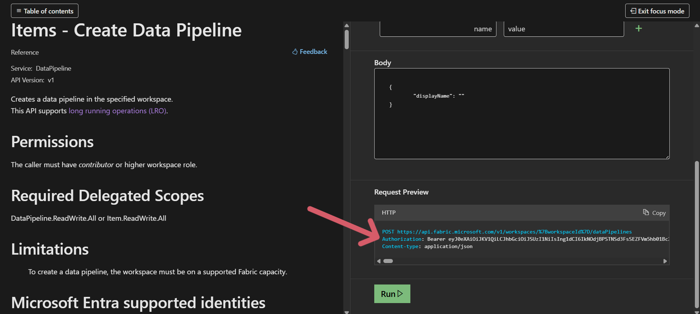
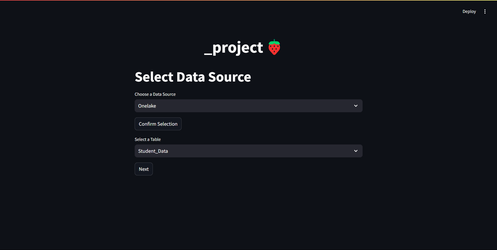
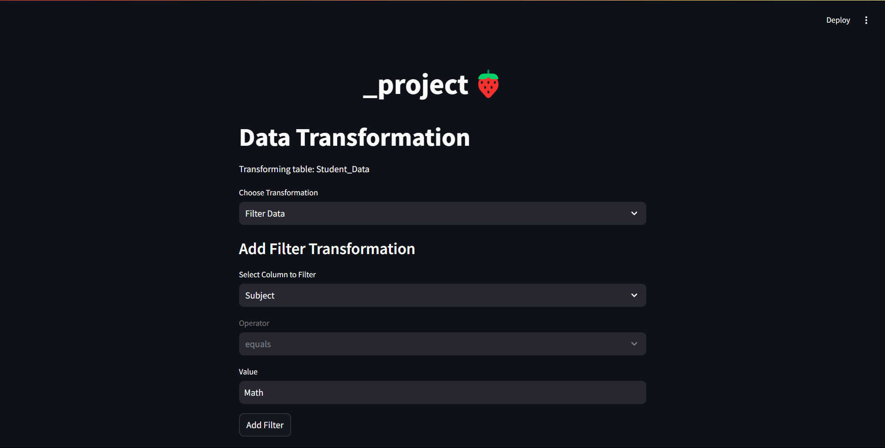
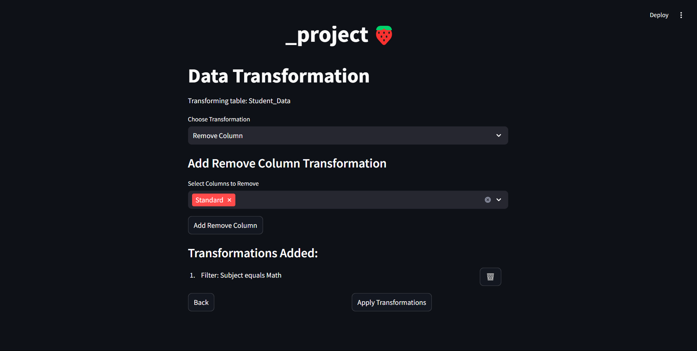
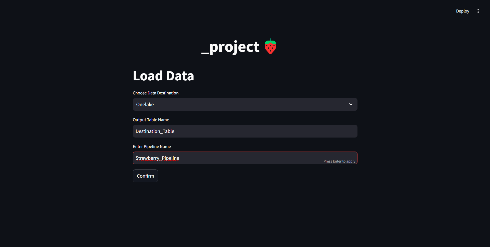
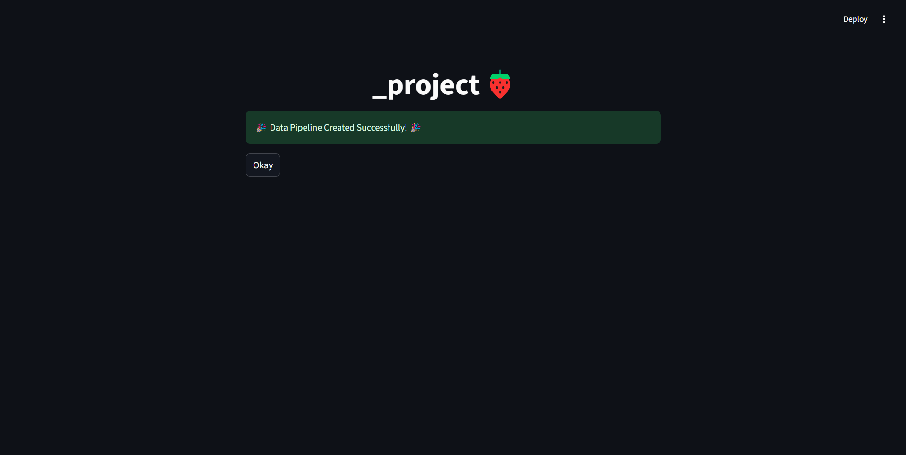
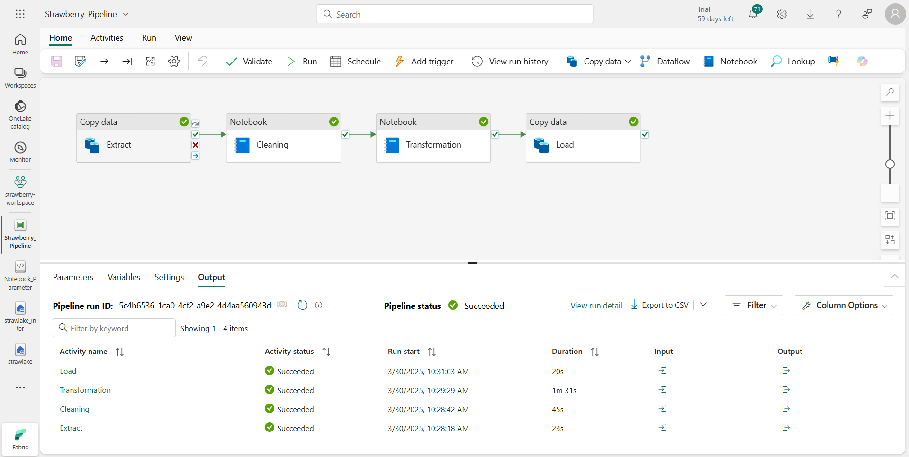
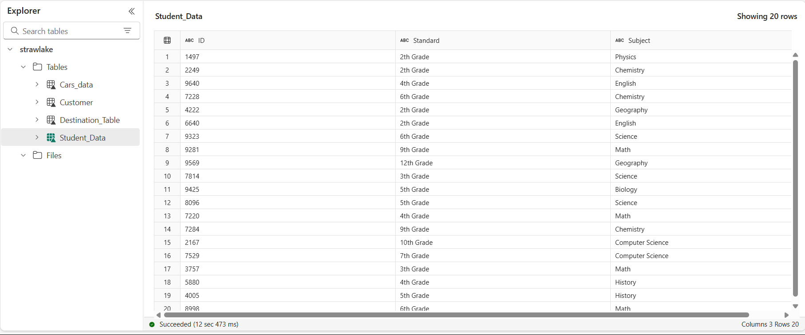
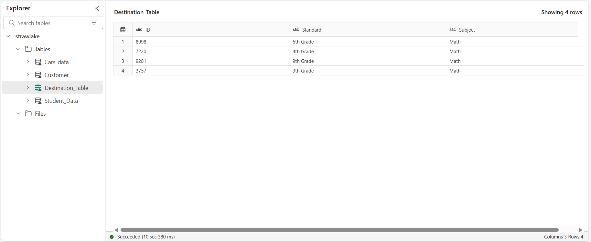

# **Self-Service Data Pipeline using Microsoft Fabric**

## **Overview**
This project enables users to create a **self-service data pipeline** using **Microsoft Fabric**. It provides a user-friendly interface built with **Streamlit**, allowing users to **fetch, clean, transform, and store tables from OneLake seamlessly**. The system automatically generates a **pipeline in Microsoft Fabric**, incorporating all the transformations specified by the user.

---

📽️ **[Pitch Deck](https://docs.google.com/presentation/d/1LDmDS8tkiBOeuDOAiWdn0tX7L22t97JB/edit?usp=sharing&ouid=102927719551280066798&rtpof=true&sd=true)** | 📖 **[Documentation](https://docs.google.com/document/d/1cXo8cavepzw93upZRo-Ova7MQ0agHYqawwSICgsW7Ns/edit?usp=sharing)**

---

## **How to Run the Application**

### **1️⃣ Clone the Repository**
```sh
git clone https://github.com/baibhav-122003/raw_strawberry.git
cd raw_strawberry
```

### **2️⃣ Install Python**
Ensure Python is installed on your system. You can download it from [python.org](https://www.python.org/downloads/).

### **3️⃣ Install Dependencies**
Install **Streamlit** and other required libraries:
```sh
pip install streamlit
```

### **4️⃣ Obtain Authentication Token**
⚠️ **Disclaimer:** Since we don’t have MS Entra ID Access, we used a workaround from the **Microsoft Product Docs**.

1. Open any **Fabric API documentation** and go to the **"Try it"** section.
   - Example: [Create Data Pipeline API](https://learn.microsoft.com/en-us/rest/api/fabric/datapipeline/items/create-data-pipeline?tabs=HTTP#code-try-0)
2. Click **"Sign in"** with your Microsoft account.
3. Copy the **Authorization Token** from the request.
   
   
   
4. Open `main.py` and paste the token in the `AUTH_TOKEN` variable.

### **5️⃣ Run the Application**
```sh
streamlit run main.py
```

---

## **Features**
### **1️⃣ Intuitive User Interface**
✅ Developed using **Streamlit** for an **interactive and seamless user experience**.
✅ Allows users to **fetch tables from OneLake**, apply cleaning and transformations, and store modified data easily.

### **2️⃣ Data Cleaning Options**
Users can improve data quality by applying cleaning operations such as:
- **Handling null values** to ensure completeness.
- **Removing duplicate values** to maintain data integrity.

### **3️⃣ Data Transformation Options**
Users can perform various transformations, including:
- **Filtering data** based on specific values.
- **Removing unnecessary columns** to optimize the dataset.

### **4️⃣ Storing and Naming Data**
- Users can **specify a table name** to store the modified table.
- Users can also **define a pipeline name** to organize data processing workflows.

### **5️⃣ Automated Pipeline Creation in Microsoft Fabric**
Once all modifications are applied, a **pipeline is automatically created in Microsoft Fabric**, incorporating all transformations specified by the user.

---

## **Workflow Summary**
1️⃣ **Fetch a table** from **OneLake**.  
   
   
   
2️⃣ **Apply data cleaning** (remove null values, check duplicates).  
   
   
   
3️⃣ **Perform transformations** (filter data, remove columns).  
   
   
   
   
4️⃣ **Define table and pipeline names** for organized storage.  
   
   
   
5️⃣ **Automatically generate a Microsoft Fabric pipeline** with all applied modifications.  
   
   
   
   
This solution **streamlines data preparation and pipeline creation**, reducing manual effort while ensuring **efficient and accurate data processing**. 🚀

---

## **Source and Destination Tables**
### **📌 Source Table:**
   
   
   
### **📌 Destination Table:**
   
   

---

## **⚠️ Challenges Faced**

- **Limited endpoint accessibility in Microsoft Fabric**  
  Microsoft Fabric currently has a limited set of available API endpoints, as it is still under development. For example, while we could fetch table names in a Lakehouse, we were unable to retrieve column details or metadata for a specific table.

- **Minimal community support and documentation**  
  Since Microsoft Fabric is a relatively new technology, online resources, community forums, and official documentation are limited. This led us to experiment and find our own solutions through trial and error.

- **Adaptive cleaning and transformation requirements**  
  Implementing dynamic data cleaning and transformation posed a challenge. We addressed this by using **Parameters** to specify transformations and passing them into a notebook for execution.

- **Restricted access to Microsoft Fabric**  
  Our team had limited access to Microsoft Fabric resources due to the lack of Microsoft Entra ID and Service Principal access. This prevented us from leveraging certain APIs, such as those for managing ADLS Gen 2 resources, reducing the scope of automation.

---

## **🚀 Future Scope**

- **Enhanced data cleaning and transformation operations**  
  Expanding the available cleaning and transformation functions to include more complex operations such as data type conversion, advanced deduplication, and outlier detection.

- **Data ingestion from diverse sources**  
  Supporting data extraction from a wider range of sources, including APIs, databases, cloud storage, and on-premises systems.

- **Simultaneous execution of multiple pipelines**  
  Enabling users to create and manage multiple data pipelines (having similar configurations) in parallel, optimizing efficiency for large-scale data processing.

- **Memory and resource optimizations**  
  Improving performance by optimizing memory usage and computational efficiency, ensuring scalability for larger datasets.

- **Enhanced data security and governance**  
  Strengthening data protection by incorporating access controls, audit logging, and compliance monitoring features.

---

🙏 **Thanks for checking out our project!** 🚀

For any feedback or inquiries, feel free to reach out to **Team Strawberry🍓**
([Baibhav Kumar](mailto:baibhav.k@sigmoidanalytics.com) | [Nilesh Phapale](mailto:nilesh.p@sigmoidanalytics.com) | [Atharva Kale](mailto:atharva.k@sigmoidanalytics.com) | [Akshat Agrawal](mailto:akshat.a@sigmoidanalytics.com) | [Ankit Debroy](mailto:ankit.d@sigmoidanalytics.com))